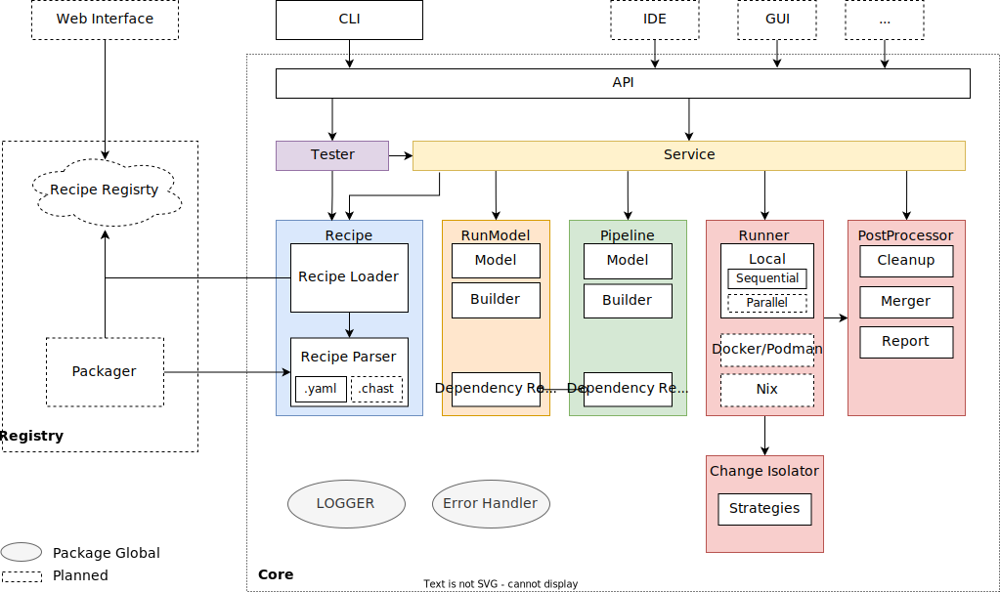

# CHAST

*CHAST* short for *Change Stuff!*

[//]: # ([![CI]&#40;https://github.com/tj-actions/coverage-badge-go/workflows/CI/badge.svg&#41;]&#40;https://github.com/chast-io/chast-core/actions&#41;)

[-E95420?logo=ubuntu\&logoColor=white)](https://docs.github.com/en/actions/reference/workflow-syntax-for-github-actions#jobsjob_idruns-on)
[-white?logo=linux\&logoColor=black)](https://docs.github.com/en/actions/reference/workflow-syntax-for-github-actions#jobsjob_idruns-on)
[-000000?logo=apple\&logoColor=F0F0F0)](https://docs.github.com/en/actions/reference/workflow-syntax-for-github-actions#jobsjob_idruns-on)
[-0078D6?logo=windows\&logoColor=white)](https://docs.github.com/en/actions/reference/workflow-syntax-for-github-actions#jobsjob_idruns-on)

This is the core of chast.
Run refactorings and other commands through an unified system no matter which operating system, installer or programming
language.

> :warning: **Work in progress!** :construction:
> 
> This project is in its early stages of development.
> 
> * The API is not stable and may change at any time. 
> * Documentation is not complete.
> * The project is not tested on all operating systems.
> * Available recipies are prove of concept and not production ready.

## Why CHAST?

Ever did a refactoring and you had the feeling "I've done this several times now, there should be an automation for it!". Sometimes you are in luck and there is indeed a refactoring, but where do you find it? And when you have found it, how do you make sure it really does what is should and does not affect your system negatively? Furthermore, there should be instructions on how to use it and some kind of check for you to verify the quality.
On the other hand,  a developer of such a refactoring faces similar problems. "I need a CLI, there should be tests and documentation, and where do I release it?".

CHAST, short for Change Stuff, tries to solve this problem. It creates a framework for creating refactoring tools, builds a platform to release it and defines a unified way to test and document the tool. It also is not limited to refactorings of a single language and includes several ways to handle dependencies and versioning of the tools. But CHAST should not stop at refactorings; CHAST can be used to run tools and installation independent of the underlying operating system. Soon the age of numerous different installation scripts ends and all you have to do is to run a single command which does all the necessary steps for you.

So what are you waiting for? Let's CHAnge STuff!

## Demo

* Demo Docker Container: [CHAST Demo](example/demo/README.md)

## Required tools

- **General**
  - [unionfs-fuse](https://github.com/rpodgorny/unionfs-fuse) (Linux only, for Apple see MacOS support section in their README)
  - user namespace support required
  - (For OverlayFs-MergerFs-Isolation-Strategy: OverlayFs, Fuse, MergerFs required)

## Installation

No installation candidates available yet. Need to be built from source.

## Feature Status

> For additional feature ideas, add them to [Feature Proposal](https://github.com/chast-io/chast-core/discussions/17)

* Change Isolator :white_check_mark:
* Reporting :white_check_mark: (basic)
* Change Merging :white_check_mark:
* File Detection and Run Filtering :white_check_mark:
* Dependency Resolution :white_check_mark:
* Runner :construction:
  * Sequential Runner :white_check_mark:
  * Parallel Runner :construction:
  * Docker/Podman Support
  * Nix Support
* Test Runner :white_check_mark:
* Recipe Packager
* Recipe Registry
  * Registry Web Interface
* Dedicated CHAST Language
* Documentation Parser
* Functionality Extension
  * Unified Installation
  * Linting
  * Formatter
* Operatig Systems
  * Linux :construction:
    * Ubuntu :white_check_mark:
    * Other
  * Windows
  * MacOS

## Development

- [Go](https://golang.org/doc/install) (1.19.2 or higher)
- [GolangCI-Lint](https://golangci-lint.run/usage/install/)
- See: [Required tools](#required-tools)

### Build

Build with `go build -o chast ./main.go` in the `cli` directory.

Run it with `./chast`

### Structure

* cli - The command line interface. 
  * This is the entry point for the user. See [Build](#build)
* core - The core of CHAST. 
  * This is the main package of CHAST. It contains the core functionality and the API for the other packages.
* example - Example implementations of CHAST.
  * This package contains example implementations of CHAST. It is used for testing and demonstration purposes.
  * A corresponding docker image is available. See [Demo](#demo).
* test - Testing recipe implementation of CHAST.
    * The provided IntelliJ IDEA run configurations are configured to run with those examples.
* *registry*, *repository*: Placeholder packages for the registry and repository implementations.
* .github/workflows - GitHub Actions workflows.
  * This directory contains the GitHub Actions workflows for the project.

#### Repositories

* [chast-io](https://github.com/chast-io?type=source)/**[chast-refactoring-java](https://github.com/chast-io/chast-refactoring-java)** - Refactorings specifically to Java.
* [chast-io](https://github.com/chast-io?type=source)/**[chast-refactoring-antlr](https://github.com/chast-io/chast-refactoring-antlr)** - Refactorings based on the parser generator ANTLR. Those refactorings are intended to support multiple languages.

### Architecture

### Testing

The project aims to reach a high test coverage to ensure correctness. Currently only the most essential and non trivial parts of the code have unit tests.

Integration tests should later be included through running CHAST against the tests specified in recipes.
